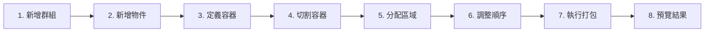

# 3D Packing System (3D 打包系統)

一個基於 Three.js 和 Flask 的 3D 容器打包可視化系統，支持自定義容器形狀、區域切割、物件分組與智能打包算法。

##  功能

-  **自定義容器** - 支持矩形、L型、T型、U型等多種容器形狀
-  **容器切割** - 可將容器切割成多個區域（zones）
-  **物件管理** - 批量新增、分組管理物件
-  **區域分配** - 將物件群組拖放分配到不同區域
-  **排序控制** - 拖曳調整物件打包順序
-  **智能打包** - 自動計算最佳打包方案
-  **3D 可視化** - 實時預覽打包結果
-  **數據持久化** - SQLite 數據庫儲存所有配置

##  技術棧

### 前端
- **Vite** - 開發服務器與打包工具
- **Three.js** - 3D 渲染引擎
- **Vanilla JavaScript** - 原生 JS，無框架依賴
- **HTML5 Canvas** - 2D 繪圖（容器切割功能）

### 後端
- **Flask** - Python Web 框架
- **SQLite** - 輕量級數據庫
- **自研打包算法** - 基於 3D bin packing

##  系統需求

- Node.js >= 16.0
- Python >= 3.8
- 現代瀏覽器（Chrome/Edge/Firefox）

## 🚀 快速開始

### 1. 安裝依賴

#### 前端依賴
```bash
cd c:\Users\GIGABYTE\blf_sa\3js\three.js
npm install
```

#### 後端依賴
```bash
pip install -r requirements.txt
```

### 2. 啟動應用

#### 方式一：使用統一啟動腳本（推薦）
```bash
python start_servers.py
```
> ⚠️ **注意**：此方式會清空數據庫！適合全新開始。

**這個腳本會：**
- ✅ 清空並重建數據庫（`RESET_DB=1`）
- ✅ 啟動 Flask 後端（端口 8888）
- ✅ 啟動 Vite 前端（端口 5173）

#### 方式二：分別啟動（保留數據）

**1. 啟動後端（不清空數據）：**
```bash
python -m src.api_server_v2.app
```

**2. 啟動前端：**
```bash
cd three.js
npx vite
```

### 3. 訪問應用

-  **前端頁面**: http://localhost:5173
-  **後端 API**: http://localhost:8888/api

---

## 📁 專案結構

```
three.js/
├── src/
│   ├── api_server_v2/          # Flask 後端 API
│   │   ├── app.py              # API 主程序
│   │   ├── init_db.py          # 數據庫初始化
│   │   ├── db_config.py        # 數據庫配置
│   │   ├── groups_items/       # 群組與物件 API
│   │   ├── containers_zones/   # 容器與區域 API
│   │   └── sequence/           # 打包序列 API
│   │
│   ├── py_packer_v2/           # 打包算法核心
│   │   ├── main.py             # 算法入口
│   │   └── packer.py           # 打包邏輯
│   │
│   ├── js_v2/                  # 前端 JavaScript
│   │   ├── group_items/        # 群組與物件管理
│   │   ├── container/          # 容器定義與切割
│   │   ├── assign/             # 區域分配與排序
│   │   ├── view/               # 結果預覽
│   │   └── sidebar/            # 側邊欄導航
│   │
│   ├── html/                   # HTML 頁面
│   ├── css/test_version/       # CSS 樣式
│   └── lib/                    # Three.js 庫文件
│
├── index.html                  # 主入口頁面
├── diagnostic.html             # 🔧 系統診斷工具
├── package.json                # 前端依賴
├── requirements.txt            # 後端依賴
├── vite.config.js              # Vite 配置
├── start_servers.py            # 統一啟動腳本
└── README.md                   # 本文件
```

---

##  診斷工具 (diagnostic.html)

訪問 `http://localhost:5173/diagnostic.html` 可進行系統診斷。

### 功能說明

**1. 前後端連接測試**
- ✅ 檢測前端是否正常運行
- ✅ 檢測後端 API 是否可訪問
- ✅ 驗證跨域配置（CORS）

**2. API 端點測試**
```
測試項目：
├─ GET  /api/groups           # 獲取所有群組
├─ GET  /api/items            # 獲取所有物件
├─ GET  /api/containers/v2    # 獲取容器配置
├─ GET  /api/zones            # 獲取切割區域
└─ GET  /api/sequence/latest-result  # 獲取最新打包結果
```

**3. 數據庫狀態檢查**
-  顯示當前數據庫中的數據數量
-  群組、物件、區域、打包結果統計

**4. 問題排查建議**
- 🔴 後端無法連接 → 檢查 Flask 是否啟動
- 🟡 API 返回錯誤 → 查看後端日誌
- 🟢 所有測試通過 → 系統正常

### 使用時機
- ✅ 初次部署時驗證環境
- ✅ 頁面無法正常顯示數據時
- ✅ API 調用失敗時快速定位問題

---

##  使用流程

### 完整工作流程



### 詳細步驟

#### 1. 新增群組 (Add Group)
- 創建物件分類（例如：A類貨物、B類貨物）
- 群組可包含多個相同或不同尺寸的物件

#### 2️. 新增物件 (Add Inventory)
- 批量新增物件到指定群組
- 支持一次新增多個相同尺寸的物件
- 自動生成唯一 ID（如：`item_1`, `item_2`...）

#### 3️. 定義容器 (Define Container)
- 選擇容器形狀：矩形、L型、T型、U型
- 設置容器尺寸（長寬高）
- 實時 3D 預覽

#### 4️. 切割容器 (Cut Container)
- 在 2D 平面繪製切割線
- 將容器分割成多個區域（zones）
- 標記每個區域的用途

#### 5️. 分配區域 (Assign Space)
- 拖放群組到對應區域
- 每個區域可包含多個群組
- 視覺化顯示分配關係

#### 6️. 調整順序 (Assign Sequence)
- 選擇區域
- 拖曳調整物件打包順序
- 影響最終打包結果

#### 7️. 執行打包 (Execute Packing)
- 點擊「執行打包」按鈕
- 系統為每個區域分別計算打包方案
- 顯示打包成功的提示

#### 8️. 預覽結果 (View Final)
- 3D 可視化顯示打包結果
- 查看空間使用率、已打包/未打包數量
- 物件列表詳情

---

## 🔑 核心特性

### 區域化打包

與傳統打包系統不同，本系統支持：
- ✅ **多區域獨立打包** - 每個切割區域單獨計算
- ✅ **群組綁定** - 特定群組只打包到指定區域
- ✅ **尺寸約束** - 使用區域尺寸而非原始容器尺寸

**範例：**
```
原始容器: 1000×1000×500
├─ 區域A (600×400×500) → 群組1
├─ 區域B (400×400×500) → 群組2
└─ 區域C (1000×600×500) → 群組3
```

### 批量操作優化

**問題：** 逐個插入 100 個物件需要 100 次 API 請求，非常慢。

**解決方案：** 使用批量 API (`/api/items/bulk`)
```javascript
// 一次插入 100 個物件
POST /api/items/bulk
{
  "items": [
    {"item_id": "item_1", "group_id": 1, "length": 100, ...},
    {"item_id": "item_2", "group_id": 1, "length": 100, ...},
    ...
  ]
}
```
**性能提升：10-100倍！** 🚀

---

## 🗃️ 數據庫結構

### 主要數據表

| 表名 | 說明 | 主要字段 |
|------|------|---------|
| `groups` | 物件群組 | `id`, `name`, `description` |
| `items` | 物件清單 | `item_id`, `group_id`, `length`, `width`, `height` |
| `containers` | 容器配置 | `id`, `parameters` (JSON) |
| `zones` | 切割區域 | `id`, `label`, `length`, `width`, `height` |
| `zone_assignments` | 區域分配 | `zone_id`, `group_id` |
| `packing_results` | 打包結果 | `job_id`, `zone_id`, `result_json`, `packed_count` |

### 數據持久化

- ✅ **手動重啟保留數據** - 使用 `python -m src.api_server_v2.app`
- ❌ **start_servers.py 清空數據** - 設置 `RESET_DB=1`

---

## 🐛 常見問題

### Q1: 頁面刷新後數據消失？
**A:** 使用 `start_servers.py` 啟動會清空資料庫。改用：
```bash
python -m src.api_server_v2.app  # 保留數據
```

### Q2: 新增大量物件時很慢？
**A:** 已優化為批量插入，確保使用最新版本代碼。

### Q3: 打包結果不顯示？
**A:** 
1. 打開瀏覽器控制台（F12）查看錯誤
2. 訪問 `diagnostic.html` 檢查 API 狀態
3. 確認已執行打包操作

### Q4: 如何清空所有數據重新開始？
**A:** 
```bash
python start_servers.py  # 自動清空並重建數據庫
```

---

## 📝 開發說明

### 添加新功能

1. **前端頁面**：在 `src/html/` 添加 HTML
2. **前端邏輯**：在 `src/js_v2/` 對應模塊添加 JS
3. **後端 API**：在 `src/api_server_v2/` 添加路由
4. **數據庫**：修改 `init_db.py` 添加新表

### 代碼風格

- JavaScript: ES6+ 語法，使用對象字面量模式
- Python: PEP 8 規範
- 前端：Vanilla JS（無框架）
- 後端：RESTful API 設計

---
**最後更新：** 2025-12-28  
**版本：** v2.0